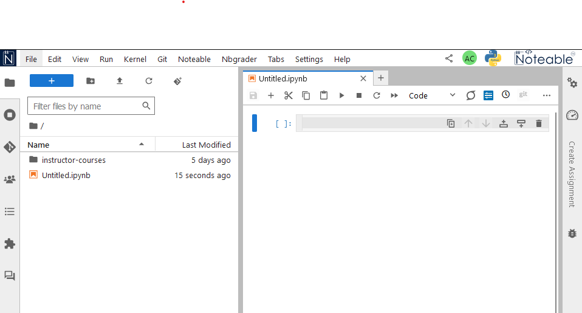
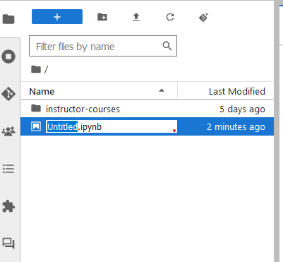
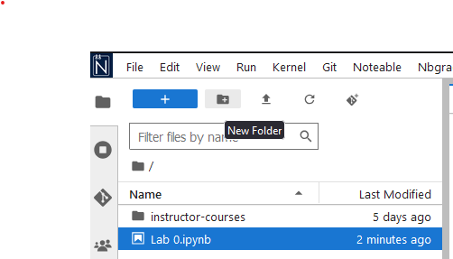

# Getting started with Noteable

For this course, you will be using [Noteable](https://noteable.edina.ac.uk/launch) to host and run your Jupyter notebooks.

## Logging into Noteable

Access Noteable via the link on the CH12004 Moodle page.

You'll be presented with a page like this

Select "Standard Notebook (Python 3)" and click "Start".

If this is the first time you have logged on to Noteable, you will see the following:

On the left is the Jupyter **File Browser**, which shows all of your files and folders/directories saved in Noteable. On the right is the **Launcher**, which contains buttons for quickly creating notebooks and shells. 

## Creating a new Jupyter notebook

To create a new Jupyter notebook, click on the `Python 3 (ipykernel)` button in the **Notebook** section of the **Launcher**.

This will open a new Jupyter Notebook document in a new browser window, which should look like this:

## Renaming notebooks

We will look at using Jupyter Notebooks in more detail later. For now, notice at the top you have the text &ldquo;Untitled&rdquo;. This is a placeholder filename that has been assigned to this new Notebook you have just created. To rename your notebook, right click on `Untitled.ipynb` in the **File Browser** and click rename.

**Do not delete the `.ipynb` extension when renaming your notebook - Noteable will break if you do!**

Rename your notebook to something more meaningful (e.g., &ldquo;Lab 0&rdquo;) by typing the new name and hitting Enter.

You should then see the notebook name at the top of the screen change to the new name.

## Notebook management

Your notebook is the place that you will **run** (execute) your code. Doing so uses resources (memory and CPU) on whichever computer you are running on.
In this instance, these are servers run by Noteable. If you run something that consumes a lot of resources, it can make your calculations run slowly. Sometimes this happens because you might have written your code incorrectly or inefficiently - this is fine and is a part of learning. It is therefore useful to know how to stop (Shutdown) a Jupyter notebook which might be unresponsive or slow.

This can be done using the square stop button, located on the notebook toolbar.

If that doesn't work, then you can restart the Kernel (think of this as a reboot of the system) by clicking the `Kernel` tab of the Notebook menu followed by the `Restart Kernel` option.

## Using folders

While you could keep all of your notebooks in your top-level folder (what you see when you first log in to Noteable), over time, this can make it difficult to find the specific notebook you are looking for, so it is better to organise your notebooks using folders.

In the **File Browser**, click the **New Folder** icon to create a new folder.

Name this folder `CH12004`. This is where you should place all of your Jupyter Notebook files.

Drag and drop your `Lab 0.ipynb` file into the `CH12004` folder. It might take a second for the file to "disappear", but if you double click on the `CH12004` folder, you'll now see your notebook.

To make a new notebook in this directory, simply click the blue `+` button to make a new **Launcher**.

And then click the `Python 3 (ipykernel)` Button in the **Notebooks** section.

## Closing down and reconnecting
Close all of your Noteable browser windows.
Your folders and files are saved on the Noteable server.
You can reconnect to the server and see your folders and files by clicking again on the Noteable link on the CH12004 Moodle page.

